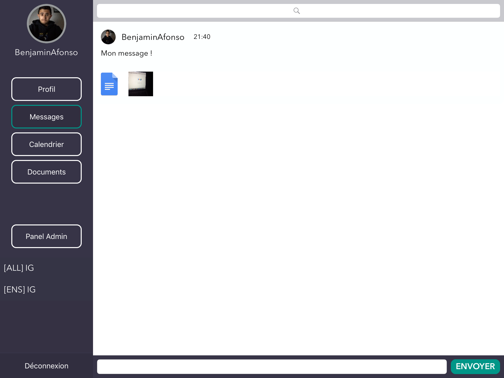
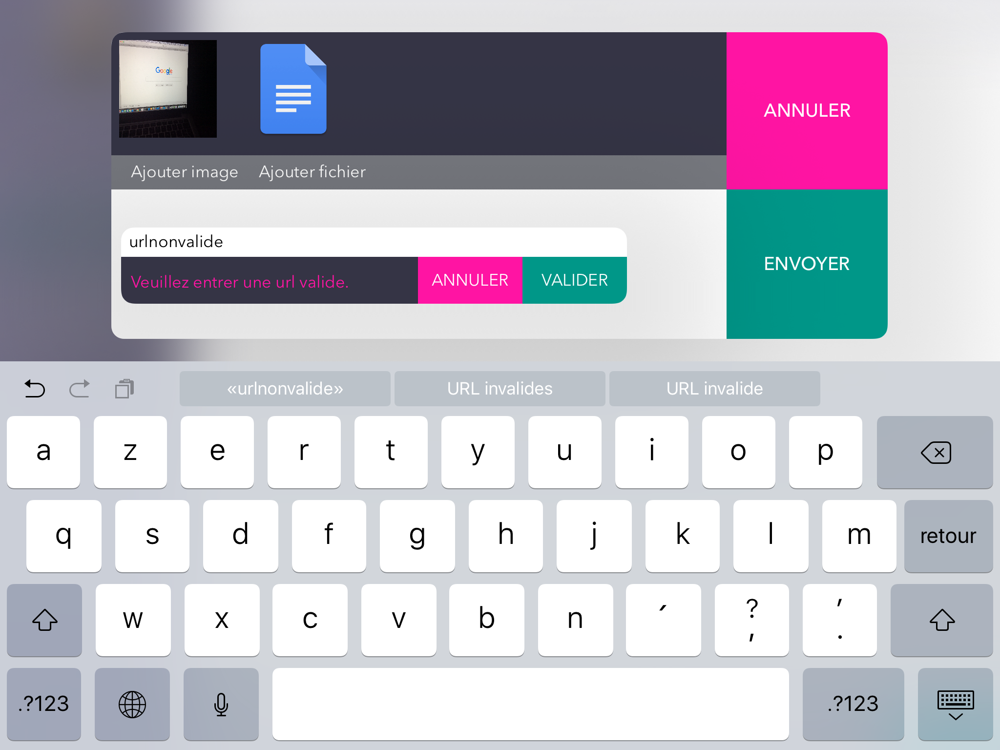
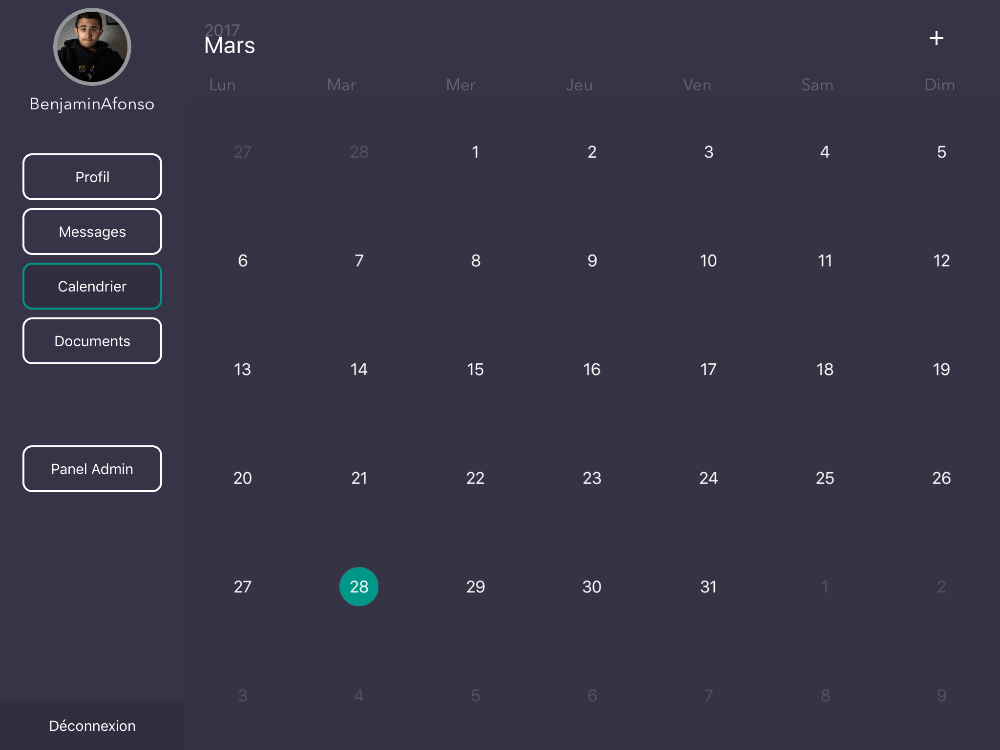
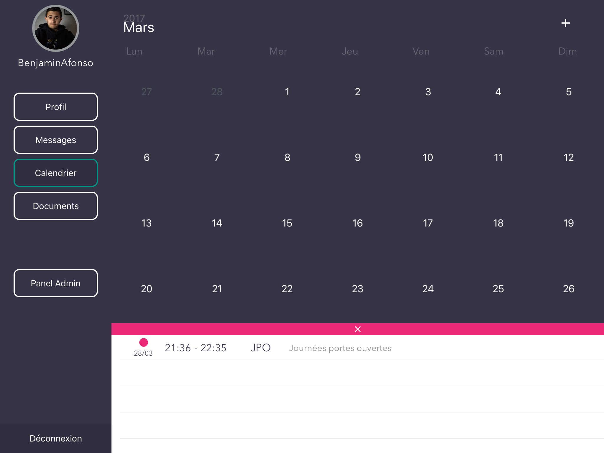
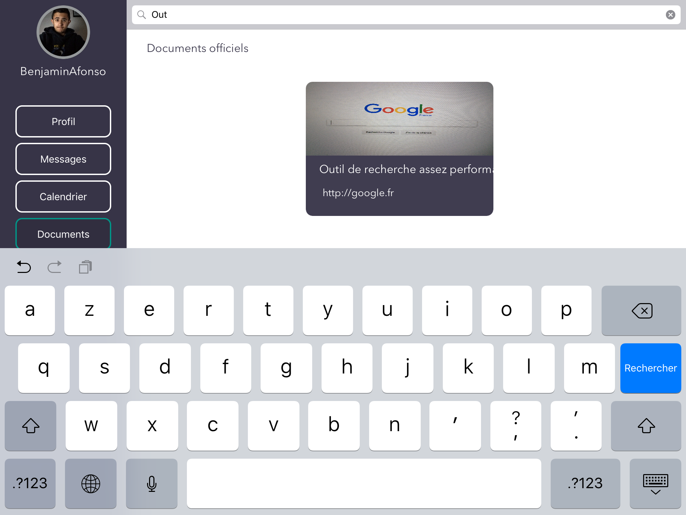
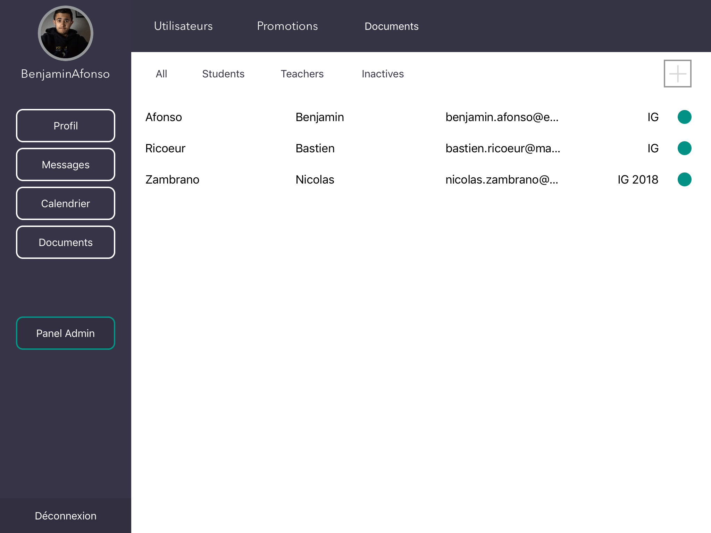
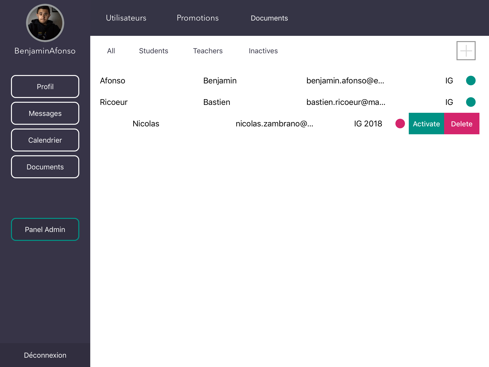
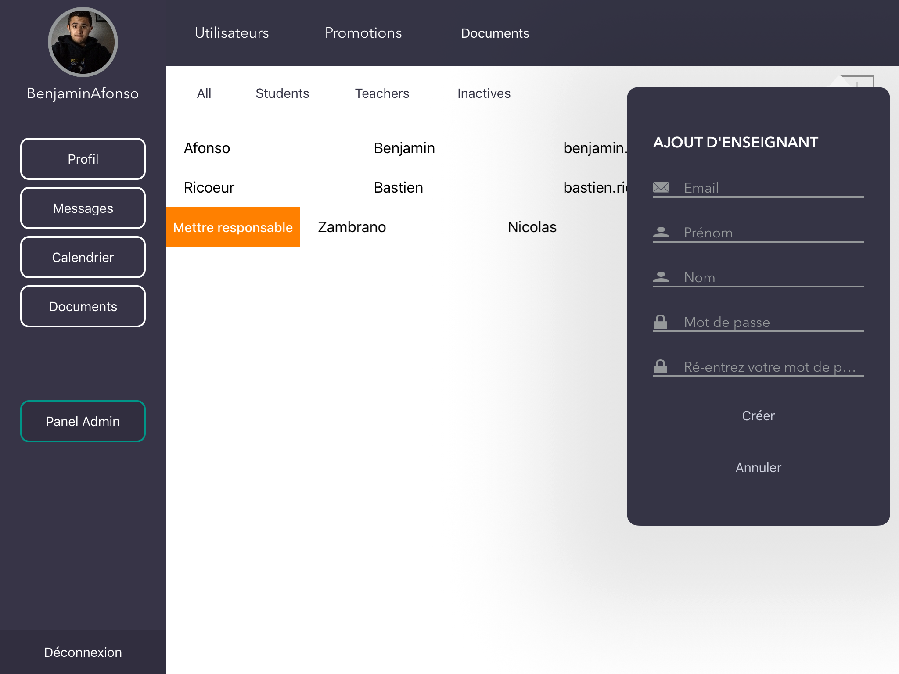
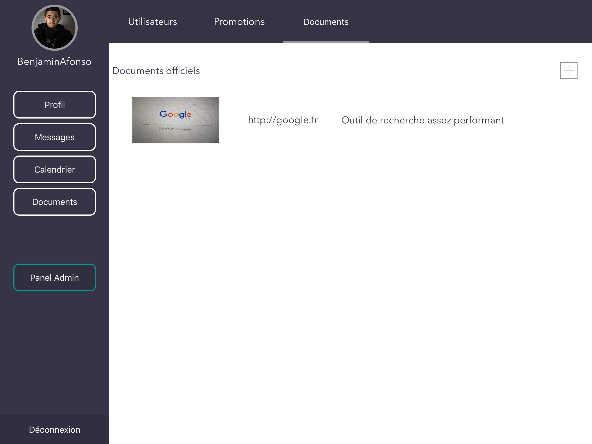

footer: Ben Afonso - Bastien Ricoeur

# **_FlowBook_** 
## Projet iOS - IG4

---

# **_FlowBook_** 
## [fit] Pas uniquement une application 
## [fit] *_application Jolie_*
---

## Login

---

## Inscription

---

## Picker

---

# Partie **_Utilisateur_**

--- 

## Profil

---

## Messages

---

## Nouveau message

---

## Ajout de pièces jointes

---

## Visualisation de fichiers joints

---

## Recherche de message

---

## Suppression de message

---

## Autres canaux

---

## Calendrier

---

## Evènements

---

## Ajout d'évènement

---

## Documents

---

## Recherche de documents

---

# Partie **_Administrateur_**

---

## Affichage des utilisateurs

---

## Swipe sur les utilisateurs

---

## Utilisateurs inactifs

---

## Quoi ? Dans ce sens là aussi ?

---

## Responsable de département

---

## Ajout de professeur

---

## Affichage des promotions

---

## Ajout de documents

